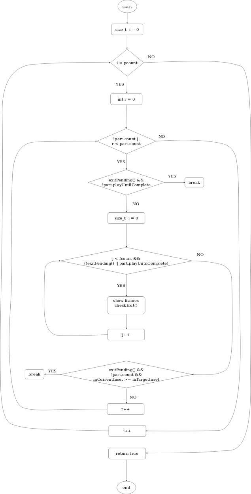

# انیمیشن راه‌اندازی سیستم‌عامل

انیمیشین راه‌اندازی سیستم‌عامل اندروید از روی یک فایل zip واقع در آدرس system/media بارگذاری می‌شود. این فایل فشرده‌ خود از یک فایل با نام desc.txt و تعدادی پوشه با نام‌های part1، part0 و . . . تشکیل شده است. داخل هر پوشه تعدادی عکس وجود دارد که تمامی عکس‌ها به صورت پشت سر هم نمایش داده می‌شوند تا برای کاربر یک تصویر متحرک را شبیه‌سازی نمایند. 

## ساختار فایل انیمیشن
در فایل desc.txt نحوه نمایش تصاویر برای سیستم‌عامل تشریح می‌شود. خط اول این فایل به ترتیب از چپ به راست طول و عرض تصاویر و همچنین نرخ فریم بر ثانیه را نشان می‌دهد.
در خط‌های بعدی نحوه نمایش فایل‌های هر پوشه بیان می‌شود. برای درک بهتر این بخش از مثال زیر استفاده می‌کنیم:</br>
```
# desc.txt
1440 480 60
c 1 0 part0
c 0 0 part1
c 1 0 part2
c 1 1 part3
c 1 0 part4
```
در این مثال، خط اول به سیستم‌عامل می‌گوید که تصاویر استفاده شده در این انیمیشن دارای کیغیت ۱۴۴۰ در ۴۸۰ پیکسل بوده و همچنین باید با نرخ ۶۰ فریم بر ثانیه نمایش داده شوند. خط‌های بعدی نیز به ترتیب نحوه نمایش تصاویر هر پوشه را به سیستم‌عامل اطلاع می‌دهد. در صورتی که حرف اول c باشد، سیستم‌عامل تمامی تصاویر آن پوشه را تا انتها به طور کامل نمایش خواهد داد ولی اگر این حرف ‌p باشد، سیستم‌عامل تا زمان به پایان رسیدن راه‌اندازی سیستم تنها تصاویر این پوشه را نشان می‌دهد. بخش دوم نشان‌دهنده تعداد دفعات نمایش تصاویر داخل یک پوشه است. اگر عدد غیر صفر باشد، تصاویر به مقدار آن عدد نمایش داده خواهند شد ولی اگر صفر باشد تصاویر تا زمانی که راه‌اندازی سیستم‌عامل به پایان نرسیده باشد، نمایش داده خواهند شد و پس از پایان راه‌اندازی سیستم‌عامل بخش‌های بعدی نمایش داده خواهند شد. عدد سوم مدت زمانی که پس از پایان نمایش تصاویر آن پوشه باید وقفه ایجاد شود، بیان می‌کند. عدد ۱ یعنی پس از پایان نمایش تصاویر این پوشه، سیستم‌عامل باید به اندازه زمان نمایش یک فریم صبر کند و سپس بقیه بخش‌ها را نمایش دهد. بخش آخر نیز نام پوشه حاوی تصاویر را نشان می‌دهد.


## روش نمایش انیمیشن توسط اندروید
اکنون که با فرمت و نحوه نمایش انیمیشین راه‌انداز در سیستم‌عامل اندروید آشنا شدیم، اشاره به متد اجرای این انیمیشن در سیستم‌عامل نیز خالی از لطف نیست. 

کدهای مربوط به تعریف و نمایش ساختارهای داده‌ای انیمیشین راه‌انداز در آدرس  cmds / bootanimation  کد منبع اندروید قرار دارد. در این پوشه ساختارها و فایل‌های لازم جهت تعریف و نمایش انیمیشن راه‌انداز قرار داده شده است. متد نمایش انیمیشین نیز در فایل BootAnimation.cpp قرار دارد. داخل این فایل نحوه خواندن فایل desc.txt و همچنین نمایش تصاویر بیان شده است. 

متد playAnimation(const Animation& animation) کار اصلی نمایش تصاویر را انجام می‌دهد. این متد ابتدا بخش‌های انیمشین را که در متد‌های قبلی خوانده‌شده در قالب یک ساختار ‌Animation دریافت کرده و سپس با استفاده از یک حلقه for برای هر یک از بخش‌های انیمیشین اینگونه عمل می‌کند: در صورتی که در بخش در حال اجرا، تعداد تکرار نمایش تصاویر عدد صفر نباشد، تصاویر آن پوشه را به تعداد دفعات لازم(مقدار عدد) نمایش داده و سراغ بخش‌های بعدی می‌رود ولی چنانچه برای آن بخش، تعداد دفعات نمایش تصاویر عدد صفر یعنی بی‌نهایت ذکر شده باشد، حلقه داخلی، تصاویر را د‌ائما نمایش می‌دهد با این تفاوت که در انتهای هر بار نمایش کامل تصاویر داخل پوشه، یکبار متد checkExit اجرا می‌شود. این متد مقدار ویژگی service.bootanim.exit را از سیستم‌عامل دریافت می‌کند و در صورتی‌ که مقدار آن true باشد(به این معنی که راه‌اندازی سیستم‌ پایان پذیرفته)، نمایش تصاویر این پوشه (که تعداد آن بی‌نهایت بوده) متوقف شده و تصاویر پوشه بعدی اجرا می‌شود. در نهایت پس از اجرای تمامی بخش‌های انیمیشین و اتمام آن‌ها، واسط گرافیکی اصلی سیستم‌عامل نمایش داده می‌شود.




متد `checkExit` به شرح زیر است:

```
# BootAnimation.cpp
void BootAnimation::checkExit() {
    // Allow surface flinger to gracefully request shutdown
    char value[PROPERTY_VALUE_MAX];
    property_get(EXIT_PROP_NAME, value, "0");
    int exitnow = atoi(value);
    if (exitnow) {
        requestExit();
        mCallbacks->shutdown();
    }
}
```

این متد با فراخوانی مقدار پارامتر سیستمی service.bootanim.exit، اتمام راه‌اندازی گوشی را بررسی می‌کند. چنانچه راه‌اندازی به پایان رسیده باشد مقدار نهایی true و در غیر این صورت false خواهد شد. در صورت true بودن مقدار نهایی متدهای requestExit و mCallbacks->shutdown اجرا شده و در نتیجه تابع exitPending مقدار true خواهد گرفت و نمایش انیمیشن به پایان خواهد رسید.<br/>
نکته: با دقت در متن فوق می‌توان دریافت که بخش اصلی راه‌اندازی گوشی از روشن شدن آن تا true شدن مقدار ویژگی service.bootanim.exit است. معمولا تا قبل از true شدن مقدار این متد، یک بخش از انیمشین به طور تکراری نمایش داده می‌شود و پس از پایان راه‌اندازی گوشی، سایر بخش‌های انیمشین نیز(در صورت وجود) نمایش داده خواهد شد. 

در ادامه تعدادی انیمیشن راه‌انداز برای نسخه‌های مختلف اندروید ارائه می‌شود.

[انیمیشین راه‌انداز Lineage](bootanimation.zip)

