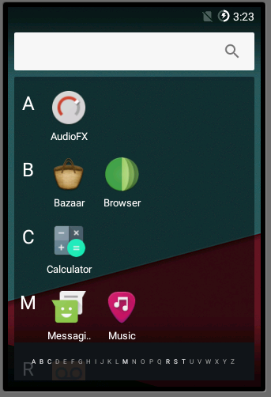

# افزودن یک برنامه‌ی پیش‌فرض به سیستم‌عامل اندروید

برای افزودن یک فایل apk پیش ساخته به فرایند build مراحل زیر انجام شود:

۱.در مسیر **packages/apps**   یک پوشه با نام نرم افزار مورد نظر اضافه کنید.

۲.به داخل پوشه رفته فایل apk مورد نظر را قرار دهید و یک فایل با نام Android.mk درست کنید 

۳.فایل Android.mk را باز کنید و محتویات زیر را در آن قرار دهید.


```
LOCAL_PATH := $(call my-dir)

include $(CLEAR_VARS)

LOCAL_MODULE_TAGS := optional
LOCAL_MODULE := <your folder name>
LOCAL_SRC_FILES := <your apk file>
LOCAL_MODULE_CLASS := APPS
LOCAL_MODULE_SUFFIX := $(COMMON_ANDROID_PACKAGE_SUFFIX)

include $(BUILD_PREBUILT)
```

۴.به مسیر **vendor/bna/config** رفته و فایل **common_bna.mk** را باز کنید و عمل زیر را انجام دهید:
```
PRODUCT_PACKAGES += <your app folder name>
```
۵.اکنون فرآیند  build(ساخت) را دوباره انجام دهید.(مسلما زمان بسیار کمتری صرف فرآیند ساخت خواهد شد)

در صورتی که به  **ninja: error:  missing and no known rule to make it** برخورد کردید میتوانید از این لینک استفاده کنید:
```
https://groups.google.com/forum/#!topic/android-building/p9mkMQhRSFU
```

اکنون با باز کردن emulator اگر به عنوان مثال برنامه کافه بازار را اضافه کرده باشید خوهید دید:

